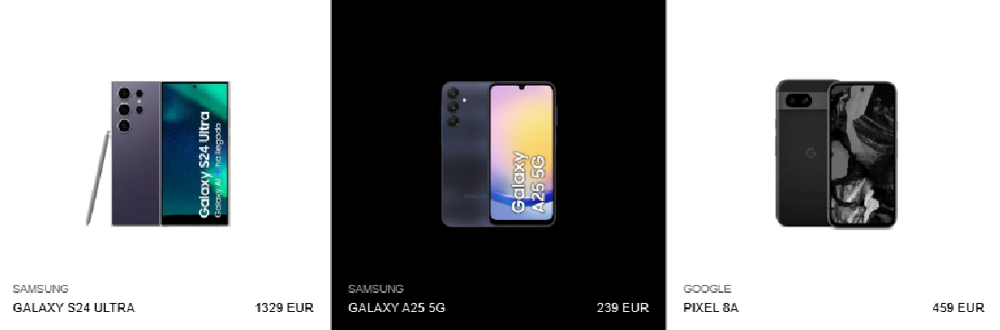

# ✨ Prueba Técnica: Catálogo de Smartphones ✨

Aplicación web para la visualización y gestión de un catálogo de teléfonos móviles.

**[➡️ Ver despliegue en Vercel](URL_DE_TU_DEPLOY)**



## 🚀 Características Principales

* **Listado de Productos**: Carga inicial del catálogo y navegación a la página de detalle.
* **Búsqueda en Tiempo Real**: Filtrado por marca o modelo con optimización de rendimiento mediante el hook **`useDebounce`**.
* **Detalle de Producto**: Galería de imágenes dinámica, selección de especificaciones (color, almacenamiento) y actualización de precios en tiempo real.
* **Carrito de Compras**: Añadir, eliminar y visualizar productos. El estado del carrito es **persistente** gracias a `localStorage`.

---

## 🛠️ Stack Tecnológico y Aspectos Destacados

La arquitectura del proyecto está diseñada para ser modular, escalable y mantenible.

* **Next.js (React)**: Aprovechado para optimización de imágenes, SSR y **Generación de Sitios Estáticos (SSG)** con `getStaticProps` y `getStaticPaths` en las páginas de detalle, logrando tiempos de carga mínimos.

* **TypeScript**: Para un código tipado, robusto y con mejor autocompletado, reduciendo errores en tiempo de desarrollo.

* **Gestión de Estado**: `React Context` combinado con el hook **`useReducer`** para un manejo del carrito predecible y escalable.

* **Hooks Personalizados**: La lógica se ha abstraído en hooks como `useProducts`, `useDebounce` y `useCustomScroll` para mantener componentes limpios y fomentar la reutilización.

* **Estilos con SASS**: **CSS Modules** para estilos encapsulados por componente y **variables CSS** para un sistema de diseño consistente y fácil de mantener.

* **Testing y Calidad de Código**: Pruebas unitarias y de integración con **Jest** y **React Testing Library** sobre componentes, hooks y reducers. **ESLint**, **Prettier** y **Husky** garantizan un código consistente y limpio en cada commit.

---

## ⚙️ Cómo Ponerlo en Marcha

1.  **Clonar el repositorio:**
    ```bash
    git clone [https://github.com/vranha/zara-smartphones.git](https://github.com/vranha/zara-smartphones.git)
    cd zara-smartphones
    ```

2.  **Instalar dependencias:**
    ```bash
    npm install
    ```

3.  **Configurar variables de entorno:**
    Crear un fichero `.env.local` en la raíz y añadir la API Key como vemos en el fichero de ejemplo `.env.example`:
    ```
    NEXT_PUBLIC_API_KEY=87909682e6cd74208f41a6ef39fe4191
    ```

4.  **Ejecutar la aplicación:**
    ```bash
    npm run dev
    ```
    La aplicación estará disponible en [http://localhost:3000](http://localhost:3000).

### Scripts Disponibles
- `npm run dev`: Inicia en modo desarrollo.
- `npm run build`: Crea la build de producción.
- `npm run start`: Inicia en modo producción.
- `npm run test`: Ejecuta la suite de tests.
- `npm run lint`: Analiza el código con ESLint.
- `npm run format`: Formatea todo el código del proyecto con Prettier.

---

## 💖 Calidad y Buenas Prácticas

Se ha puesto especial atención en los siguientes puntos:

* **Rendimiento**: Optimizaciones clave como el uso de `useDebounce`, la generación estática (SSG) de Next.js y el componente `next/image`.
* **Accesibilidad (A11y)**: Foco en la semántica HTML y mejoras como `aria-live` para contenido dinámico.
* **Diseño Responsive**: Interfaz adaptable a dispositivos móviles, tablets y escritorio.
* **Experiencia de Usuario (UX)**: Implementación de estados de carga con componentes **Skeleton**, proporcionando una carga visualmente agradable.