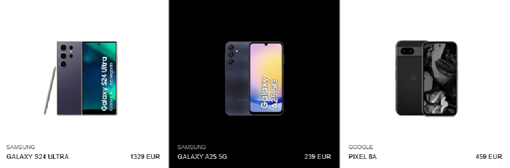

# ✨ Prueba Técnica: Catálogo de Smartphones ✨

Aplicación web para la visualización y gestión de un catálogo de teléfonos móviles..

**[➡️ Ver despliegue en Vercel](https://zara-smartphones-9951.vercel.app/)**



## 🚀 Características Principales

* **Listado de Productos**: Carga inicial del catálogo y navegación a la página de detalle.
* **Búsqueda en Tiempo Real**: Filtrado por marca o modelo con optimización de rendimiento mediante el hook **`useDebounce`**.
* **Detalle de Producto**: Galería de imágenes dinámica, selección de especificaciones y actualización de precios en tiempo real.
* **Carrito de Compras**: Añadir, eliminar y visualizar productos. El estado del carrito es **persistente** gracias a `localStorage`.

---

## 🛠️ Stack Tecnológico y Calidad

La arquitectura del proyecto está diseñada para ser modular y escalable, con un fuerte foco en la calidad del código y el rendimiento.

* **Next.js (React)**: Aprovechado para SSR y **Generación de Sitios Estáticos (SSG)** con `getStaticProps` y `getStaticPaths` en las páginas de detalle.
* **TypeScript**: Para un código tipado, robusto y más mantenible.
* **Gestión de Estado**: `React Context` combinado con el hook **`useReducer`** para un manejo del carrito predecible y escalable.
* **Hooks Personalizados**: La lógica se ha abstraído en hooks como `useProducts` y `useDebounce` para mantener componentes limpios.
* **Testing y CI**: Pruebas con **Jest** y **RTL**. **ESLint**, **Prettier** y **Husky** garantizan un código consistente en cada commit.
* **Calidad de la Interfaz**:
    * **Accesibilidad (A11y)**: Foco en la semántica HTML y mejoras como `aria-live` para contenido dinámico.
    * **Rendimiento y UX**: Estados de carga con componentes **Skeleton** y optimización de imágenes con `next/image`.

---

## 🎨 Mejoras Propuestas sobre el Diseño (Figma)

Aunque el objetivo era replicar el diseño de Figma, durante el desarrollo identifiqué algunas áreas de mejora para futuras iteraciones:

* **Consistencia de Idioma**: El diseño mezcla textos en inglés y castellano. Se sugiere unificar a un solo idioma.
* **Alineación de Imágenes**: Los márgenes internos de las imágenes en el grid son diferentes, lo que provoca una ligera variación de tamaño entre ellas. Incluso alguna tiene fondo blanco en lugar de transparente.
* **Información en Detalle**: En la vista de detalle del producto falta la "marca" (brand) del dispositivo.

---

# 🌟 Mejoras Implementadas (Rama `features/improvements`)

Para demostrar la escalabilidad del proyecto, he creado una rama alternativa (`features/improvements`) donde he implementado varias mejoras funcionales:

* **Selector de Cantidad**: Ahora es posible añadir múltiples unidades de un mismo smartphone al carrito.
* **Previsualización de Colores**: En el listado principal, cada tarjeta de producto muestra los colores disponibles mediante pequeños indicadores.
* **Navegación por Color**: Al hacer clic en un indicador de color, se navega directamente a la página de detalle con ese color ya seleccionado.

*(Esta rama alternativa no dispone de testing.)*

---

## ⚙️ Cómo Ponerlo en Marcha

1.  **Clonar el repositorio:**
    ```bash
    git clone [https://github.com/vranha/zara-smartphones.git](https://github.com/vranha/zara-smartphones.git)
    cd zara-smartphones
    ```

2.  **Instalar dependencias:**
    ```bash
    npm install
    ```

3.  **Configurar variables de entorno:**
    Crear un fichero `.env.local` y añadir la API Key (ver `.env.example`).
    ```
    NEXT_PUBLIC_API_KEY=87909682e6cd74208f41a6ef39fe4191
    ```

4.  **Ejecutar la aplicación:**
    ```bash
    npm run dev
    ```
    La aplicación estará disponible en [http://localhost:3000](http://localhost:3000).

### Scripts Disponibles
-   `npm run dev`: Inicia en modo desarrollo.
-   `npm run build`: Crea la build de producción.
-   `npm run test`: Ejecuta los tests.
-   `npm run lint`: Analiza el código con ESLint.
-   `npm run format`: Formatea todo el código.

## 🧪 Testing

El proyecto incluye una suite completa de **70+ tests** que cubren:

- ✅ **Lógica de Negocio**: cartReducer y hooks complejos
- ✅ **Componentes Críticos**: ProductPurchasePanel, CartContent
- ✅ **Interacciones de Usuario**: SearchInput, CartItem
- ✅ **Componentes de Presentación**: PhoneCard, Container


## Autor

- [@vranha](https://www.github.com/vranha)

